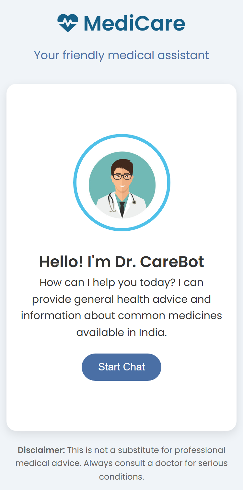
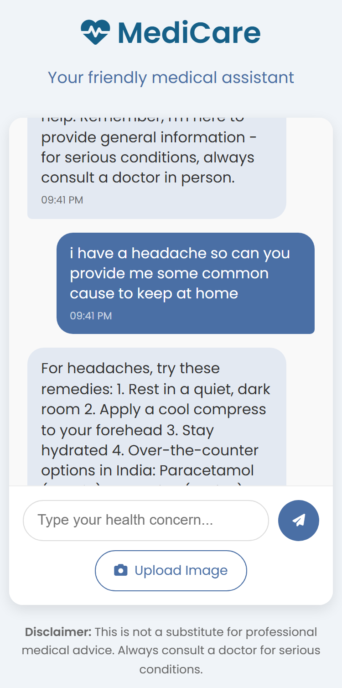

# 🏥 MediCare

MediCare is a smart, AI-powered web application designed to provide instant medical insights and health support to users by leveraging OpenAI's advanced natural language processing and the extensive medical API from API Ninjas.

---

## 🚀 Features

- 💬 **AI Chat Support** powered by OpenAI
- 🩺 **Real-time Medical Data** via API Ninjas
- 🌐 **Interactive Frontend**
- 🔐 **Secure API Integration** using environment variables
- ⚡️ **Fast and Lightweight**

---

## 🖼️ Screenshots

### 🏠 Home Page

### 💬 Chatbot in Action

---

## 🔧 Getting Started

### 1. Clone the Repository

git clone https://github.com/your-username/MediCare.git
cd MediCare

### 2. Add Your API Keys
Create a .env file in the root folder:

OPENAI_API_KEY=your_openai_api_key_here
NINJA_API_KEY=your_api_ninjas_key_here

🛡️ Your keys are safe as .env is excluded in .gitignore.

### 3.Install Dependencies

npm install

### 4.Run the Server

node server.js

### 5.Open in Browser

Visit: http://localhost:3000

🌟 Contributions

Want to contribute? Feel free to fork the repo, open issues or submit PRs. Let’s make MediCare even better together!

🙏 Credits

-OpenAI
-API Ninjas
